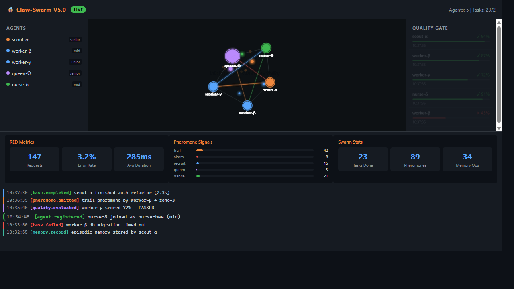

[**中文**](README.zh-CN.md) | English

# Claw-Swarm V5.6

**Bio-inspired swarm intelligence plugin for OpenClaw with 6-layer architecture, 20+ algorithms, structured DAG orchestration, speculative execution, work-stealing, state-convergence, runtime global-modulator, three feedback loops, governance triple metrics, and full observability.**


<p align="center">
  
  <br>
  <em>Real-time monitoring dashboard with Gource-inspired swarm visualization (<code>http://localhost:19100/?demo</code>)</em>
</p>

---

## Overview

Claw-Swarm is a **bio-inspired swarm intelligence plugin** for [OpenClaw](https://github.com/nicepkg/openclaw) that brings self-organizing multi-agent coordination to LLM-powered workflows. It models agent collaboration after real bee colonies — using pheromone trails, gossip protocols, and structured memory to let autonomous agents discover, negotiate, and complete tasks without centralized control.

### What problems does it solve?

| Challenge | Symptom | Claw-Swarm Solution |
|-----------|---------|---------------------|
| **Collaboration blind spots** | Agents unaware of each other's progress | Indirect pheromone communication + Gossip protocol + StigmergicBoard |
| **Memory fragmentation** | Knowledge lost after context window reset | 3-tier memory (working / episodic / semantic) |
| **Scheduling inefficiency** | Manual task assignment, no adaptability | DAG decomposition + Contract Net + ABC scheduling + Lotka-Volterra dynamics |
| **Tool brittleness** | Single API failure cascades to full stop | AJV pre-validation + per-tool circuit breaker + retry injection + failure vaccination |
| **Observability gap** | No visibility into swarm dynamics | Real-time hex-hive dashboard + RED metrics + SSE + Jaeger-lite tracing |
| **Idle resources** | Agents sitting idle while tasks queue up | Idle detection + automatic recruit pheromone emission |

### Why 6 layers?

The 4-layer V4.0 architecture became bloated after adding DAG orchestration, Contract Net, and knowledge graph modules. V5.0 re-divided responsibilities into 6 cleanly separated layers, with dependencies flowing strictly downward (L6 → L1). Only L5 couples to OpenClaw — L1–L4 can be independently reused in any Node.js 22+ environment.

---

## Key Features / 核心特性

| Feature / 特性 | Description | 描述 |
|---|---|---|
| **6-Layer Architecture** | Clean separation: infra, comm, agent, orchestration, app, monitoring | 六层解耦：基础设施、通信、智能体、编排、应用、监控 |
| **18+ Bio-Inspired Algorithms** | MMAS, ACO, Ebbinghaus, BFS, PARL, GEP, CPM, Jaccard, MoE, FIPA CNP, ABC, k-means++, Lotka-Volterra, FRTM, cosine similarity, PI controller + more | 18+ 种仿生/经典算法融合 |
| **3-Tier Memory** | Working (focus/context/scratchpad), Episodic (forgetting curve), Semantic (knowledge graph) | 三级记忆：工作记忆、情景记忆、语义知识图谱 |
| **Multi-Type Pheromones** | MMAS-bounded signals with typed decay (trail/alarm/recruit/food/danger), pressure gradient auto-escalation | 多类型信息素 + 压力梯度自动升级 |
| **Stigmergic Board** | Persistent bulletin board for indirect coordination beyond short-lived pheromones | 持久公告板，补充短寿信息素的间接协调 |
| **Failure Vaccination** | Pattern-based immunization with effectiveness feedback loop | 基于模式的免疫记忆 + 效果反馈循环 |
| **DAG Orchestration** | Task decomposition, critical path, contract-net, work-stealing, DLQ | DAG 任务分解、关键路径、合同网、工作窃取、死信队列 |
| **Tool Resilience** | AJV pre-validation, per-tool circuit breaker, retry injection, adaptive repair memory | AJV 预校验、断路器、重试注入、自适应修复记忆 |
| **Hierarchical Swarm** | Agents can spawn sub-agents within governance bounds (depth + concurrency limits) | 层级蜂群：Agent 可在治理边界内派生子 Agent |
| **Lotka-Volterra Ecology** | Species competition dynamics with carrying capacity and predator-prey equations | 种群竞争动力学 + 环境容量 + 捕食方程 |
| **Response Threshold (FRTM)** | Per-agent adaptive thresholds with PI controller for homeostatic task allocation | 固定响应阈值 + PI 控制器自适应任务分配 |
| **Skill Symbiosis** | Cosine-similarity based complementarity tracking for optimal agent pairing | 余弦相似度互补性追踪，最优 Agent 配对 |
| **Swarm Decision Empowerment** | V5.3: 9-signal composite aggregation + PI-controller adaptive advisory context injection | V5.3: 9 信号源聚合 + PI 控制器自适应赋能上下文 |
| **Adaptive Arbiter (4-State)** | V5.4: DIRECT/BIAS_SWARM/PREPLAN/BRAKE mode routing with environment-aware escalation | V5.4: 四态仲裁 + 环境感知升级 |
| **Evidence Discipline** | V5.4: 3-tier evidence gate (PRIMARY/CORROBORATION/INFERENCE) with weighted scoring | V5.4: 三层证据纪律 + 加权评分 |
| **Protocol Semantics** | V5.4: 9 typed messages (REQUEST/COMMIT/ACK/...) with conversation tracking and validation | V5.4: 9 种语义消息 + 会话追踪和协议验证 |
| **Collaboration Tax** | V5.4: 5-dimension budget tracking with per-turn tax computation and per-mode ROI | V5.4: 五维预算追踪 + 协作税 + 按模式 ROI |
| **Unified Observability** | V5.4: 4-category observation (decision/execution/repair/strategy) with ring buffer | V5.4: 四类观测数据 + 环形缓冲区 |
| **State Convergence** | V5.5: SWIM failure detection (alive→suspect→dead) + anti-entropy sync with DB as truth source | V5.5: SWIM 故障探测 + 反熵同步 |
| **Global Modulator** | V5.5: Runtime work-point controller (EXPLORE/EXPLOIT/RELIABLE/URGENT) with hysteresis switching | V5.5: 运行时工作点控制器，滞后切换 |
| **Governance Metrics** | V5.5: Audit + Policy + ROI triple metrics for swarm governance | V5.5: 审计 + 策略 + ROI 三联治理指标 |
| **Three Feedback Loops** | V5.5: Strategy/Repair/Environment reflux chains for continuous self-improvement | V5.5: 策略/修复/环境三条回流链 |
| **Speculative Execution** | V5.6: Parallel candidate execution for critical-path tasks; first completion wins | V5.6: 临界路径任务并行候选执行 |
| **DAG-Orchestrator Bridge** | V5.6: Shadow plans as DAGs with CPM analysis and bottleneck detection | V5.6: 计划影子化为 DAG + CPM 分析 |
| **Work-Stealing** | V5.6: Idle agents auto-steal tasks with modulator-aware cooldown | V5.6: 空闲 Agent 自动窃取 + 调节器感知冷却 |
| **5 Bee Personas** | scout, worker, guard, queen-messenger, designer — signal-driven behavior | 5 种蜜蜂人格：侦察蜂、工蜂、守卫蜂、女王信使、设计蜂 |
| **Real-Time Dashboard** | Fastify + SSE, hex hive view, DAG graph, pheromone particles, RED metrics, breaker status, trace timeline | 实时仪表盘：六边形蜂巢、DAG 图、信息素粒子、RED 指标、断路器状态、追踪时间线 |
| **Jaeger-lite Tracing** | Lightweight distributed tracing with trace span collector and startup diagnostics | 轻量分布式追踪 span 收集器 + 启动诊断 |
| **Plugin SDK Integration** | 16 OpenClaw hooks, 8 agent tools, `{ id, register(api) }` pattern | 16 个钩子、8 个工具，标准 Plugin SDK 模式 |

---

## Architecture / 架构

```
┌─────────────────────────────────────────────────────────────┐
│  L6  Monitoring        监控层                                │
│      StateBroadcaster · MetricsCollector · DashboardService │
│      HealthChecker · ObservabilityCore · dashboard-v2.html  │
│      TraceCollector · StartupDiagnostics (SSE, port 19100)  │
├─────────────────────────────────────────────────────────────┤
│  L5  Application       应用层                                │
│      PluginAdapter · ContextService · CircuitBreaker        │
│      ToolResilience · SkillGovernor · TokenBudgetTracker    │
│      7 Tool Factories (spawn/query/pheromone/gate/          │
│                        memory/plan/zone)                    │
├─────────────────────────────────────────────────────────────┤
│  L4  Orchestration     编排层                                │
│      Orchestrator · CriticalPathAnalyzer · QualityController│
│      PipelineBreaker · ResultSynthesizer · ExecutionPlanner │
│      ContractNet · ReplanEngine · ABCScheduler              │
│      RoleDiscovery · RoleManager · ZoneManager              │
│      HierarchicalCoordinator · TaskDAGEngine                │
│      SpeciesEvolver · SwarmAdvisor · BudgetTracker          │
│      GlobalModulator · GovernanceMetrics · SpeculativeExecutor│
├─────────────────────────────────────────────────────────────┤
│  L3  Agent             智能体层                              │
│      WorkingMemory · EpisodicMemory · SemanticMemory        │
│      ContextCompressor · CapabilityEngine · PersonaEvolution│
│      ReputationLedger · SoulDesigner · SwarmContextEngine   │
│      ResponseThreshold · FailureVaccination · EvidenceGate  │
│      SkillSymbiosisTracker                                  │
├─────────────────────────────────────────────────────────────┤
│  L2  Communication     通信层                                │
│      MessageBus · PheromoneEngine · GossipProtocol          │
│      PheromoneTypeRegistry · PheromoneResponseMatrix         │
│      StigmergicBoard · ProtocolSemantics · StateConvergence │
├─────────────────────────────────────────────────────────────┤
│  L1  Infrastructure    基础设施层                             │
│      DatabaseManager (SQLite, 44 tables) · ConfigManager    │
│      MigrationRunner · 8 Repositories · 3 Schema modules    │
│      Logger · Types · MonotonicClock                        │
└─────────────────────────────────────────────────────────────┘
```

Only L5 couples to OpenClaw via Plugin SDK. Layers L1--L4 and L6 are reusable in any Node.js 22+ environment.

仅 L5 通过 Plugin SDK 与 OpenClaw 耦合。L1--L4 及 L6 可在任何 Node.js 22+ 环境中独立复用。

> **Note:** SwarmContextEngine (L3) currently operates via hook fallback (`buildSwarmContextFallback()`). Feature flag `contextEngine` is disabled by default.
>
> **注意：** SwarmContextEngine (L3) 当前通过 hook fallback 降级使用。Feature flag `contextEngine` 默认 disabled。

---

## Quick Start / 快速开始

### Prerequisites / 前置条件

- **Node.js >= 22.0.0** (required for `node:sqlite` DatabaseSync)
- **OpenClaw** with Plugin SDK support

### Installation / 安装

**npm (Recommended / 推荐):**

```bash
npm install openclaw-swarm
cd node_modules/openclaw-swarm
node install.js          # Register plugin in OpenClaw config / 注册插件到 OpenClaw 配置
openclaw gateway restart # Load the plugin / 加载插件
```

**Git clone:**

```bash
git clone https://github.com/DEEP-IOS/claw-swarm.git
cd claw-swarm
node install.js          # One-click setup / 一键安装
openclaw gateway restart # Load the plugin / 加载插件
```

The installer automatically registers the plugin path in `~/.openclaw/openclaw.json` and enables it with default configuration.

安装脚本自动在 `~/.openclaw/openclaw.json` 中注册插件路径并启用默认配置。

See [docs/installation.md](docs/installation.md) for manual installation and advanced options. / 手动安装和高级选项见安装文档。

### Configuration / 配置

Plugin-specific settings must be nested under the `config` key in `~/.openclaw/openclaw.json`. The `api.pluginConfig` receives this object directly.

插件配置必须嵌套在 `~/.openclaw/openclaw.json` 的 `config` 键内。`api.pluginConfig` 直接接收此对象。

```json
{
  "plugins": {
    "entries": {
      "claw-swarm": {
        "enabled": true,
        "config": {
          "memory": { "enabled": true, "maxPrependChars": 4000 },
          "pheromone": { "enabled": true, "decayIntervalMs": 60000 },
          "orchestration": { "enabled": true, "maxWorkers": 16 },
          "dashboard": { "enabled": false, "port": 19100 }
        }
      }
    }
  }
}
```

See [docs/installation.md](docs/installation.md) for full option reference. / 完整配置参考见安装文档。

### Model Compatibility / 模型兼容性

Claw-Swarm requires models with strong tool-calling capabilities. See [docs/model-compatibility.md](docs/model-compatibility.md) for the full guide.

Claw-Swarm 要求模型具备强工具调用能力。完整指南见 [docs/model-compatibility.md](docs/model-compatibility.md)。

| Tier | Models / 模型 | Notes / 说明 |
|---|---|---|
| **S** | Opus 4.6, Sonnet 4.6, GPT-5.4, GPT-5.3-Codex, Gemini 2.5 Pro | Best tool calling + reasoning / 最佳工具调用 + 推理 |
| **A** | Kimi K2.5, Qwen3.5-Plus/Max, DeepSeek-V3, Gemini 2.5 Flash, o4-mini | Strong with minor trade-offs / 强，少量取舍 |
| **B** | DeepSeek-Reasoner, GLM-5, Qwen3-Coder-Next, MiniMax-M2.5, Llama 4 Maverick | Usable for specific roles / 特定角色可用 |

---

## Bio-Inspired Algorithms / 仿生算法

| # | Algorithm / 算法 | Layer | Module | Purpose / 用途 |
|---|---|---|---|---|
| 1 | **MMAS** (Max-Min Ant System) | L2 | PheromoneEngine | Pheromone intensity bounding / 信息素强度上下界 |
| 2 | **ACO Roulette** (Ant Colony Optimization) | L2 | PheromoneEngine | Probabilistic path selection / 概率路径选择 |
| 3 | **Pheromone Pressure Gradient** | L2 | PheromoneResponseMatrix | V5.2: Auto-escalation when threshold exceeded / 压力梯度自动升级 |
| 4 | **Multi-Type Pheromone Decay** | L2 | PheromoneEngine | V5.2: trail(linear), alarm(step), recruit(exp) typed decay / 类型化衰减 |
| 5 | **Stigmergic Coordination** | L2 | StigmergicBoard | V5.2: Persistent indirect coordination board / 持久间接协调公告板 |
| 6 | **Ebbinghaus Forgetting** | L3 | EpisodicMemory | Memory decay curve / 记忆遗忘曲线 |
| 7 | **BFS Knowledge Graph** | L3 | SemanticMemory | Relation traversal / 知识图谱关系遍历 |
| 8 | **PARL** (Persona A/B) | L3 | PersonaEvolution | Persona evolution via A/B testing / 人格 A/B 进化 |
| 9 | **FRTM** (Fixed Response Threshold) | L3 | ResponseThreshold | V5.2: Per-agent adaptive thresholds + PI controller / 自适应响应阈值 |
| 10 | **Failure Vaccination** | L3 | FailureVaccination | V5.2: Pattern immunization with effectiveness tracking / 免疫记忆库 |
| 11 | **Cosine Similarity Symbiosis** | L3 | SkillSymbiosisTracker | V5.2: Agent complementarity matching / 技能互补配对 |
| 12 | **GEP** (Gene Expression) | L4 | ExecutionPlanner | Execution plan generation / 执行计划生成 |
| 13 | **CPM** (Critical Path Method) | L4 | CriticalPathAnalyzer | Task dependency scheduling / 关键路径调度 |
| 14 | **Jaccard Dedup** | L4 | ResultSynthesizer | Result deduplication / 结果去重 |
| 15 | **MoE** (Mixture of Experts) | L4 | RoleManager | Expert role routing / 专家角色路由 |
| 16 | **FIPA CNP** (Contract-Net Protocol) | L4 | ContractNet | Task negotiation / 合同网任务协商 |
| 17 | **ABC** (Artificial Bee Colony) | L4 | ABCScheduler + SpeciesEvolver | V5.2: Three-stage evolution (employed/onlooker/scout) / 三阶段进化 |
| 18 | **k-means++** | L4 | RoleDiscovery | Automatic role clustering / 角色自动发现 |
| 19 | **Lotka-Volterra** | L4 | SpeciesEvolver | V5.2: Population dynamics `dN/dt = rN(1-N/K) - αNP` / 种群竞争动力学 |

---

## OpenClaw Hooks / OpenClaw 钩子

16 hooks registered via Plugin SDK / 通过 Plugin SDK 注册 16 个钩子：

| Hook | Trigger | Internal Mapping / 内部映射 |
|---|---|---|
| `gateway_start` | Gateway starting | Engine initialization + config validation / 引擎初始化 + 配置校验 |
| `before_model_resolve` | Model selection | Model capability auto-detection / 模型能力自动检测 |
| `before_tool_call` | Tool invocation | ToolResilience AJV validation + circuit breaker / 工具韧性校验 + 断路器 |
| `before_prompt_build` | Prompt assembly | Tool failure injection + swarm context / 工具失败注入 + 蜂群上下文 |
| `before_agent_start` | Agent begins | SOUL injection + context prepend (memory, knowledge, pheromone) / SOUL 注入 + 上下文注入 |
| `agent_end` | Agent finishes | Quality gate + pheromone reinforcement + memory consolidation / 质量门控 + 信息素 + 记忆固化 |
| `after_tool_call` | Tool completes | Tool resilience + health check + working memory / 工具韧性 + 健康检查 + 工作记忆 |
| `before_reset` | Conversation reset | Memory consolidation (working → episodic) / 记忆固化 |
| `gateway_stop` | Gateway shutting down | Engine cleanup + PID file removal / 引擎关闭 + PID 清理 |
| `message_sending` | Message routed | Agent-to-agent message routing via MessageBus / 消息路由 |
| `subagent_spawning` | Sub-agent creating | Hierarchical coordinator validation / 层级协调器校验 |
| `subagent_spawned` | Sub-agent created | Hierarchy tracking / 层级追踪 |
| `subagent_ended` | Sub-agent finished | Result collection + pheromone update / 结果收集 + 信息素更新 |
| `llm_output` | LLM response | SOUL.md dual-stage migration / SOUL.md 双阶段迁移 |

Sub-agent lifecycle is managed by the hierarchical coordinator: depth limits, concurrency control, and governance gates are enforced automatically.

子 Agent 生命周期由层级协调器管理：深度限制、并发控制和治理门控自动执行。

---

## Tools / 工具

8 agent tools registered via Plugin SDK / 通过 Plugin SDK 注册的 8 个智能体工具：

| Tool | Purpose | 用途 |
|---|---|---|
| `swarm_spawn` | Create and dispatch sub-agents | 创建并调度子智能体 |
| `swarm_query` | Query swarm state and agent status | 查询蜂群状态 |
| `swarm_pheromone` | Deposit and read pheromone signals | 发布和读取信息素信号 |
| `swarm_gate` | Governance gating and capability checks | 治理门控与能力检查 |
| `swarm_memory` | Read/write agent memory (working/episodic/semantic) | 读写智能体记忆 |
| `swarm_plan` | Create and manage execution plans | 创建和管理执行计划 |
| `swarm_zone` | Manage work zones and auto-assignment | 管理工作区与自动分配 |
| `swarm_run` | V5.3: One-click execution (plan + spawn combined) | V5.3: 一键执行（计划+派生合一） |

---

## Development / 开发

### Prerequisites / 前置条件

| Requirement | Version |
|---|---|
| Node.js | >= 22.0.0 |
| Runtime deps | eventemitter3, fastify, nanoid, pino, zod |
| Dev deps | vitest |

### Testing / 测试

Claw-Swarm maintains a rigorous multi-level testing strategy to ensure production readiness:

Claw-Swarm 采用多层次测试策略确保生产可用性：

| Level | Type | Coverage | 覆盖范围 |
|-------|------|----------|----------|
| Unit | 902 tests across 49 files (vitest) | All 6 layers, every module | 6 层全覆盖 |
| Integration | End-to-end pipeline | Multi-tool workflows, memory persistence, zone governance | 跨工具流程、记忆持久化、Zone 治理 |
| Stress | High-frequency & boundary | 20+ rapid calls, WAL concurrency, edge cases | 高频调用、并发写入、边界值 |
| **Production** | **20 tests in live OpenClaw Gateway** | **Plugin load, tool invocation, MMAS, memory, quality gate, MoE, integration scenarios, stress** | **真实 Gateway 环境全链路验证** |
| **Install** | **Clean-environment install test** | **Clone → install.js → gateway restart → tool invocation on Linux** | **干净 Linux 环境一键安装全流程验证** |

The production test suite validates the plugin end-to-end in a live OpenClaw Gateway environment — not mocked, not simulated. All 20 production tests passed with 7 bugs discovered and fixed during testing. See the full report: **[Production Test Report](docs/production-test-report.md)**

The install test was independently conducted on a clean Linux (Node.js v22, OpenClaw 2026.2.13) environment — from `git clone` to `swarm_query` in under 3 minutes, 100% pass rate with 0 blocking issues. See: **[Install Test Report](docs/install-test-report.md)**

生产测试套件在真实 OpenClaw Gateway 环境中端到端验证插件 — 非 mock、非模拟。20 项生产测试全部通过，测试过程中发现并修复了 7 个 bug。完整报告见：**[生产测试报告](docs/production-test-report.md)**

安装测试在干净 Linux 环境（Node.js v22, OpenClaw 2026.2.13）中独立执行 — 从 `git clone` 到 `swarm_query` 调用成功仅需 3 分钟，100% 通过率，零阻断性问题。报告见：**[安装测试报告](docs/install-test-report.md)**

```bash
# All tests (902 tests, 49 files) / 全部测试
npm test

# By category / 按类别
npm run test:unit
npm run test:integration
npm run test:stress

# By layer / 按层级
npm run test:L1
npm run test:L2
npm run test:L3
npm run test:L4
npm run test:L5
npm run test:L6

# Watch mode / 监听模式
npm run test:watch

# Coverage report / 覆盖率
npm run test:coverage
```

---

## Project Structure / 项目结构

```
src/
├── index.js                                  # Plugin entry { id, register(api) }
│                                             # 插件入口
├── L1-infrastructure/                        # 基础设施层 (18 files)
│   ├── types.js                              # Type definitions / 类型定义
│   ├── logger.js                             # Pino-based logging / 日志
│   ├── monotonic-clock.js                    # V5.1: hrtime monotonic timing
│   ├── config/
│   │   └── config-manager.js                 # Zod-validated config / 配置管理
│   ├── database/
│   │   ├── database-manager.js               # SQLite DatabaseSync (44 tables)
│   │   ├── migration-runner.js               # Schema migrations / 迁移
│   │   ├── sqlite-binding.js                 # node:sqlite binding
│   │   └── repositories/                     # 8 data repositories
│   │       ├── agent-repo.js
│   │       ├── episodic-repo.js
│   │       ├── knowledge-repo.js
│   │       ├── pheromone-repo.js
│   │       ├── pheromone-type-repo.js
│   │       ├── plan-repo.js
│   │       ├── task-repo.js
│   │       └── zone-repo.js
│   └── schemas/
│       ├── config-schemas.js                 # Config Zod schemas
│       ├── database-schemas.js               # DB table schemas
│       └── message-schemas.js                # Message format schemas
│
├── L2-communication/                         # 通信层 (7 files)
│   ├── message-bus.js                        # Pub/sub + wildcards + DLQ
│   ├── pheromone-engine.js                   # MMAS bounds, typed decay
│   ├── gossip-protocol.js                    # Epidemic broadcast + heartbeat
│   ├── pheromone-type-registry.js            # Custom pheromone types
│   ├── pheromone-response-matrix.js          # V5.2: Pressure gradient + auto-escalation
│   ├── stigmergic-board.js                   # V5.2: Persistent bulletin board
│   └── protocol-semantics.js                 # V5.4: 9 semantic message types
│
├── L3-agent/                                 # 智能体层 (13 files)
│   ├── memory/
│   │   ├── working-memory.js                 # 3-tier: focus/context/scratchpad
│   │   ├── episodic-memory.js                # Ebbinghaus forgetting curve
│   │   ├── semantic-memory.js                # BFS knowledge graph
│   │   └── context-compressor.js             # LLM context compression
│   ├── capability-engine.js                  # 4D capability scoring
│   ├── persona-evolution.js                  # PARL A/B testing
│   ├── reputation-ledger.js                  # Agent reputation tracking
│   ├── soul-designer.js                      # 5 bee persona templates
│   ├── swarm-context-engine.js               # V5.1: Rich context builder
│   ├── response-threshold.js                 # V5.2: FRTM + PI controller
│   ├── failure-vaccination.js                # V5.2: Pattern immunization
│   ├── skill-symbiosis.js                    # V5.2: Cosine complementarity
│   └── evidence-gate.js                      # V5.4: 3-tier evidence discipline
│
├── L4-orchestration/                         # 编排层 (18 files)
│   ├── orchestrator.js                       # DAG task decomposition
│   ├── critical-path.js                      # CPM scheduling
│   ├── quality-controller.js                 # Multi-rubric quality gate
│   ├── pipeline-breaker.js                   # State machine breaker
│   ├── result-synthesizer.js                 # Jaccard deduplication
│   ├── execution-planner.js                  # GEP plan generation
│   ├── contract-net.js                       # FIPA CNP negotiation
│   ├── replan-engine.js                      # Pheromone-triggered replan
│   ├── abc-scheduler.js                      # Artificial Bee Colony
│   ├── role-discovery.js                     # k-means++ clustering
│   ├── role-manager.js                       # MoE expert routing
│   ├── zone-manager.js                       # Jaccard auto-assign
│   ├── hierarchical-coordinator.js           # V5.1: Hierarchical swarm
│   ├── task-dag-engine.js                    # V5.1: DAG + work-stealing + DLQ
│   ├── species-evolver.js                    # V5.1+V5.2: Species evolution + GEP + LV + ABC
│   ├── swarm-advisor.js                      # V5.3+V5.4: Decision empowerment + 4-state arbiter
│   └── budget-tracker.js                     # V5.4: 5-dimension collaboration tax
│
├── L5-application/                           # 应用层 (14 files)
│   ├── plugin-adapter.js                     # Engine lifecycle manager
│   ├── context-service.js                    # Rich LLM context builder
│   ├── circuit-breaker.js                    # 3-state circuit breaker
│   ├── tool-resilience.js                    # V5.1: AJV + per-tool breaker
│   ├── skill-governor.js                     # V5.1: Skill inventory + tracking
│   ├── token-budget-tracker.js               # V5.1: 800-token budget coord
│   └── tools/
│       ├── swarm-spawn-tool.js
│       ├── swarm-query-tool.js
│       ├── swarm-pheromone-tool.js
│       ├── swarm-gate-tool.js
│       ├── swarm-memory-tool.js
│       ├── swarm-plan-tool.js
│       ├── swarm-zone-tool.js
│       └── swarm-run-tool.js                 # V5.3: One-click execution
│
├── event-catalog.js                          # V5.1-V5.4: 46 EventTopics + schema
│
└── L6-monitoring/                            # 监控层 (7 files)
    ├── state-broadcaster.js                  # SSE push to clients
    ├── metrics-collector.js                  # RED metrics (Rate/Errors/Duration)
    ├── dashboard-service.js                  # Fastify HTTP + /v2 API + trace spans
    ├── dashboard.html                        # Dark theme web dashboard
    ├── dashboard-v2.html                     # V5.1: Hex hive + DAG + particles
    ├── health-checker.js                     # V5.1+V5.2: Health + idle detection
    └── observability-core.js                 # V5.4: 4-category unified observability

tests/
├── unit/
│   ├── L1/   (4 files)                       # Infrastructure tests
│   ├── L2/   (6 files)                       # Communication tests (+V5.4)
│   ├── L3/   (9 files)                       # Agent tests (+V5.4)
│   ├── L4/  (15 files)                       # Orchestration tests (+V5.4)
│   ├── L5/   (5 files)                       # Application tests (+V5.3)
│   └── L6/   (5 files)                       # Monitoring tests (+V5.4)
├── integration/  (1 file)                    # Full pipeline tests
└── stress/       (legacy)                    # Stress/edge-case tests
```

---

## License / 许可证

MIT License. Copyright 2025-2026 DEEP-IOS.

See [LICENSE](LICENSE) for full text.
